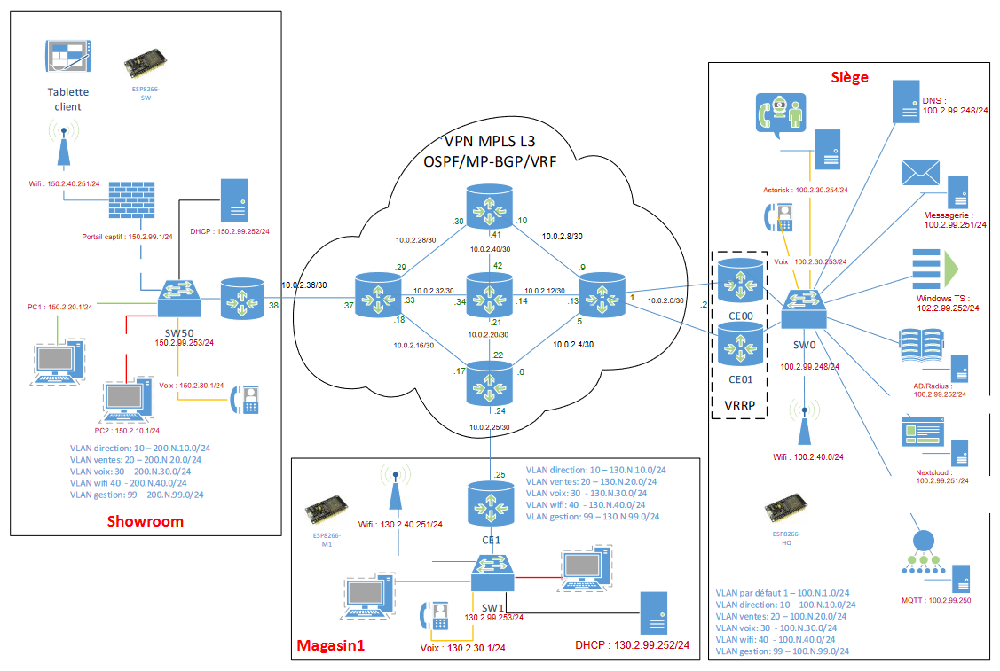

# SAE 303 : Conception d’un réseau pour l’entreprise fictive Beerok 🍺

Bienvenue dans la présentation de notre projet **SAE 303**, réalisé dans le cadre de notre **BUT Réseaux et Télécommunications**. Ce projet, mené sur une semaine intensive, avait pour objectif de concevoir et déployer un réseau complet et fonctionnel pour une entreprise fictive nommée **Beerok**. 🍻

---

## 🗂️ Contexte du projet

- **Durée** : 1 semaine  
- **Participants** : Groupes de 4 à 5 étudiants, dont 2 en parcours Cybersécurité (minimum).  
- **Objectif principal** : Concevoir un réseau complet et sécurisé avec les services nécessaires au fonctionnement de l'entreprise.  

---

## 🖥️ Architecture réseau

Nous avons conçu et mis en place une architecture réseau complète comprenant :  
- **Topologie réseau** : 3 sites principaux.  
- **Technologies utilisées** :
  - Router-on-a-Stick (RoAS) 🌐
  - VLAN pour la segmentation réseau
  - DHCP pour l’adressage automatique

 *(Schéma réseau détaillé)*

---

## 🛠️ Matériel utilisé

- 3 routeurs  
- 3 switchs  
- 1 hyperviseur sous Proxmox  
- 4 PC de l'IUT  
- 3 téléphones  
- 2 bornes WiFi  
- 1 tablette  

---

## 🎯 Organisation du projet

### 🔄 Gestion de projet
- **Outil utilisé** : [Trello](https://trello.com) 📝 pour la planification et la répartition des tâches.  
- **Jalons** : Points d'étape spécifiques définis en fonction de la priorité et de la complexité des tâches.

### 🛠️ Étapes clés
1. **Plan d’adressage IP** : [Voir le plan](./adressage_ip.pdf).  
2. **Création des machines virtuelles** : Déploiement sous Proxmox.  
3. **Configuration des services réseau** :  
   - **Services installés** :  
     - Active Directory  
     - DNS  
     - Serveur mail  
     - Terminal Server  
     - Nextcloud (avec authentification LDAP)  
     - RADIUS  
   - **Protocole réseau** :  
     - Router-on-a-Stick (RoAS) pour interconnecter les VLANs.  
     - DHCP pour chaque VLAN sur les sites distants.  

---

## 🔍 Audit de sécurité

En tant qu’étudiants en **parcours Cybersécurité**, nous avons réalisé un **audit de sécurité** du réseau grâce à l’outil **Nessus**. 🛡️  
👉 [Voir le rapport du scan réseau](./scan_reseau.pdf).

---

## 🚀 Défis relevés et apprentissages

### 💡 Compétences développées :
- Mise en place d’un réseau semi-complexe et sécurisé dans un temps restreint.  
- Gestion et déploiement d’applications critiques (Nextcloud, Active Directory).  
- Résolution de problèmes techniques sous pression.  
- Travail en équipe et gestion du temps.  

### 🤔 Problèmes rencontrés :
1. **Installation de Nextcloud** : Difficultés liées à la compatibilité de PHP (versions obsolètes).  
2. **Authentification LDAP** : Plugins PHP absents dans la version utilisée.  
3. **Audit Nessus** : Identification et correction des vulnérabilités critiques.  

---

## 📄 Ressources supplémentaires

- [Plan d’adressage IP](./adressage_ip.pdf)  
- [Rapport du projet](./cr_sae_303.pdf)  

---

## 📬 Contact

Pour plus d’informations sur ce projet, n’hésitez pas à me contacter :  
**Étienne, étudiant en BUT R&T**. Passionné par l’administration système et réseau. [https://e-paquelet.fr](https://e-paquelet.fr)  🖥️  

